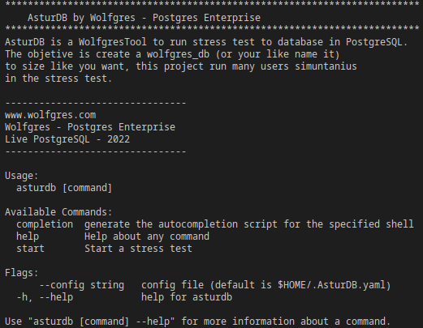

# AsturDB
## The stress tool to PostgreSQL
<!--AsturDB by Wolfgres Postgres Enterprise  is a benchmark tool to stress databases in PostgreSQL to test-->
__AsturDB by Wolfgres Postgres Enterprise__ es la herramienta para el análisis, medicion de rendimiento y pruebas de estrés sobre bases de datos PostgreSQL.

## Contenido

* [Información General](#información-general)
* [Caractirísticas Principales](#características-principales)
* [Obtener AsturDB](#obtener-asturdb)
* [Prerrequisitos](#prerrequisitos)
* [Instalación y Configuración](#instalación-y-configuración)
* [Ejecución](#ejecución)
* [Menú de Ayuda](#menú-de-ayuda)
* [Contacto](#contacto)

## Información General
AsturDB esta diseñada con el objetivo de brindar una herramienta que permita simular diversos escenarios que influyen en el rendimiento de una base de datos PostgreSQL así como obtener metricas realcionadas con la ejecución y procesamiento masivo de diversas sentencias SQL (SELECT, INSERT, UPDATE, DELETE).   

## Características Principales

- Permite crear una base de datos de un tamaño seleccionado.
- Permite seleccionar el tipo, cantidad y frecuencia de sentencias SQL para la creacion de la BD.
- Permite seleccionar el numero de registros a ser insertados en una tabla.

## Obtener AsturDB

AsturDB es de código libre, las actualizaciones más recientes se pueden obtener de manera sencilla para su uso mediante el siguiente repositorio:

````bash
    git clone https://github.com/Wolfgres/AsturDB.git
````

## Prerrequisitos

Antes de poder ejecutar AsturDB se debe de contar con las siguientes dependencias: 

|Dependencia         |Nombre      |Descripción |Versión     |
|:---             |:----:      |:----:      |---: |
|Sistema Operativo|Ubuntu, Rocky Linux, RedHat, etc.       |Compatible con sistemas basados en Unix       | 20.04 o superior   |
|Lenguaje         |Go          |Permite la ejecución de aplicaciones desarrolladas en dicho lenguaje        | 1.16 o superior      |
|Base de Datos    |PostgreSQL  |Instancia local o remota para análisis de rendimiento         | 11 o superior      |

## Instalación y Configuraión


AsturDB emplea un usuario de base de datos con privilegios de administrador en caso de no existir alguno disponible se debera de ser crear.

````bash
    postgres=# CREATE USER admin PASSWORD 'admin' SUPERUSER;
````


## pg_hba.conf
AsturDB requiere establcer una conexión con la base de datos PostgreSQL por lo cual se debe de agregar la siguiente regla de acceso dentro del archivo __pg_hba.conf__

````bash
    # TYPE  DATABASE       USER            ADDRESS                 METHOD
    # "local" is for Unix domain socket connections only
    local postgres         admin                                  scram-sha-256
    # IPv4 local connections:
    host  postgres         admin        192.168.1.100/32          scram-sha-256

````

Despues de modificar el archivo se requiere recargar la configuracion mediante
````bash
    systemctl reload postgresql@14-main.service
````

## .AsturDB.yaml

El principal archivo de configuración de AsturDB es __.AsturDB.yaml__ antes de posder utilizar la herramienta se deberan establecer los siguientes parametros.

__database:__ En este bloque de configuración se configuran los accesos a la base de datos.
* `host:` Establece la direccion ip del servidor PostrgeSQL local o remoto.
* `port:` Establece el puerto sobre el cual se ejecuta PostgreSQL.
* `admin_user:` Establece el usuario con priviligios de superusuario para la creacion de la base de datos.
* `admin_pass:` Establece la clave del super usuario.
* `test_user:` Establece el usuario que empleara AsturDB para la ejecucio de sentencias SQL.
* `test_pass:` Establece la clave del usuario test.
* `database:` Establece el la base de datos empleada inicialmente para establecer la conexion entre AsturDB y PostgreSQL.

__Ejemplo:__
````bash
    database:
      host: 192.168.1.100
      port: 5432
      admin_user: admin
      admin_pass: admin
      test_user: wolfgres_user
      test_pass: wolfgres_pass
      database: postgres
````

## Ejecución
Una vez completada la configuración se puede iniciar la ejecución de la herramienta mediante el siguiente comando:  

__Sintaxis:__
````bash
    go run main.go --config /ruta_a_configs/.AsturDB.yaml start
````
__Ejemplo:__
````bash
    go run main.go --config /opt/AsturDB/configs/.AsturDB.yaml start
````

## Menú de Ayuda

AsturDB cuenta con una lista de comandos a los cuales se puede acceder mediante el siguiente comando:
````bash
    go run main.go --help
````


## Contacto
Creado por [Wolfgres](https://www.wolfgres.com/) - Para cualquier pregunta o sugerencia puedes comunicarte con nosotros en soporte@wolfgres.com.mx