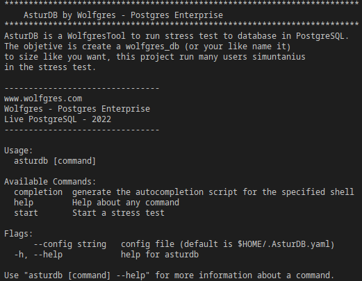

## The stress tool to PostgreSQL
<!--AsturDB by Wolfgres Postgres Enterprise  is a benchmark tool to stress databases in PostgreSQL to test-->
__AsturDB by Wolfgres Postgres Enterprise__ is the tool for analysis, performance measurement and stress testing of PostgreSQL databases.

## Contents

* [General information](#general-information)
* [Main Features](#main-features)
* [Get AsturDB](#get-asturdb)
* [Prerequisites](#prerequisites)
* [Instalación y Configuración](#instalación-y-configuración)
* [Execution](#execution)
* [Help Menu](#help-menu)
* [Contact](#contact)

## General information
AsturDB is designed with the aim of providing a tool that allows simulating various scenarios that influence the performance of a PostgreSQL database as well as obtaining metrics related to the execution and massive processing of various SQL statements (SELECT, INSERT, UPDATE, DELETE).

## Main Features

- Allows you to create a database of a selected size.
- Allows you to select the type, quantity and frequency of SQL sentences for the creation of the DB.
- Allows you to select the number of records to be inserted in a table.

## Get AsturDB

AsturDB is open source, the most recent updates can be easily obtained for use through the following repository:

````bash
    git clone https://github.com/Wolfgres/AsturDB.git
````

## Prerequisites

Before being able to run AsturDB, you must have the following dependencies:

|Dependence         |Name      |Description |Version     |
|:---             |:----:      |:----:      |---: |
|Operating system|Ubuntu, Rocky Linux, RedHat, etc.       |Compatible with Unix-based systems       | 20.04 or higher   |
|Language         |Go          |Allows the execution of applications developed in said language        | 1.16 or higher      |
|Database    |PostgreSQL  |Local or remote instance for performance analysis         | 11 or higher      |

## Installation and configuration


AsturDB uses a database user with administrator privileges, if there is none available, it should be created.

````bash
    postgres=# CREATE USER admin PASSWORD 'admin' SUPERUSER;
````


## pg_hba.conf
Astur DB requires establishing a connection with the PostgreSQL database, so the following access rule must be added to the __pg_hba.conf__ file.

````bash
    # TYPE  DATABASE       USER            ADDRESS                 METHOD
    # "local" is for Unix domain socket connections only
    local postgres         admin                                  scram-sha-256
    # IPv4 local connections:
    host  postgres         admin        192.168.1.100/32          scram-sha-256

````

After modifying the file it is required to reload the configuration by means of

````bash
    systemctl reload postgresql@14-main.service
````

## .AsturDB.yaml

The main configuration file of AsturDB is __.AsturDB.yaml__ Before using the tool, the following parameters must be established.

__database:__ Access to the database is configured in this configuration block.
* `host:` Sets the ip address of the local or remote PostgreSQL server.
* `port:` Sets the port on which PostgreSQL runs.
* `admin_user:` Sets the user with superuser privileges for database creation.
* `admin_pass:` Sets the password of the super user.
* `test_user:` Sets the user that AsturDB uses to execute SQL sentences.
* `test_pass:` Sets the test user's password.
* `database:` Sets the database used initially to establish the connection between AsturDB and PostgreSQL.

__Example:__
````bash
    database:
      host: 192.168.1.100
      port: 5432
      admin_user: admin
      admin_pass: admin
      test_user: wolfgres_user
      test_pass: wolfgres_pass
      database: postgres
````

## Execution:
Once the configuration is complete, the execution of the tool can be started using the following command:

__Sintax:__
````bash
    go run main.go --config /ruta_a_configs/.AsturDB.yaml start
````
__Example:__
````bash
    go run main.go --config /opt/AsturDB/configs/.AsturDB.yaml start
````

## Help Menu

AsturDB has a list of commands that can be accessed using the following command:
````bash
    go run main.go --help
````


## Contact
Created by [Wolfgres](https://www.wolfgres.com/) - For any question or suggestion you can contact us at soporte@wolfgres.com.mx


